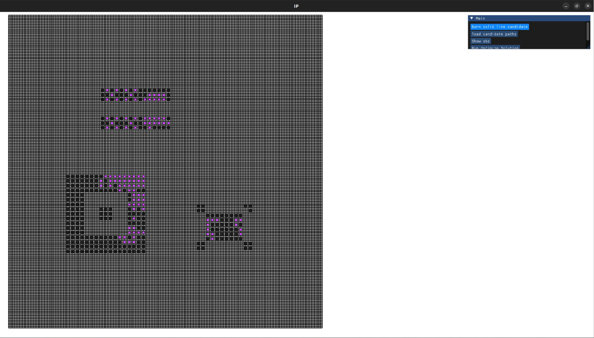
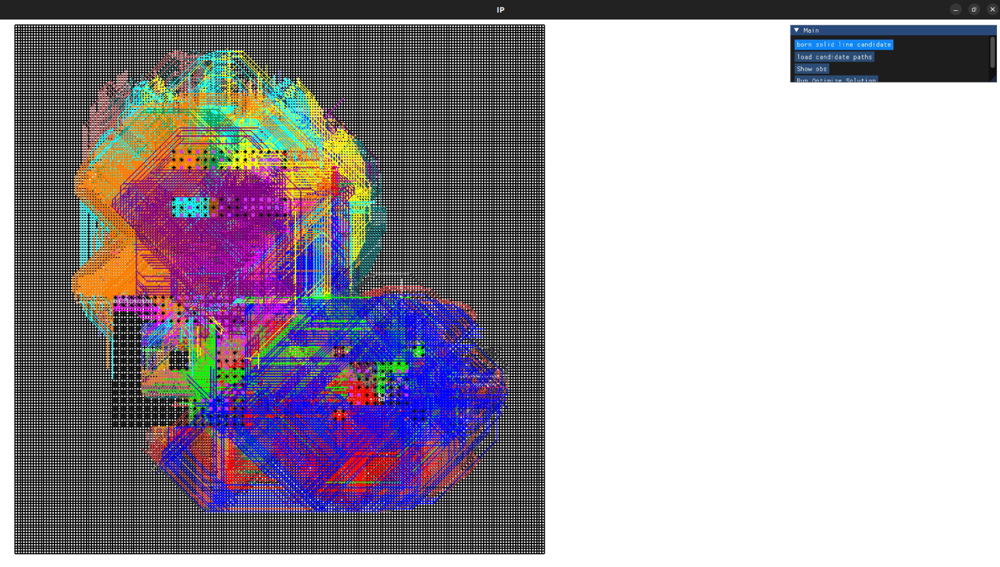
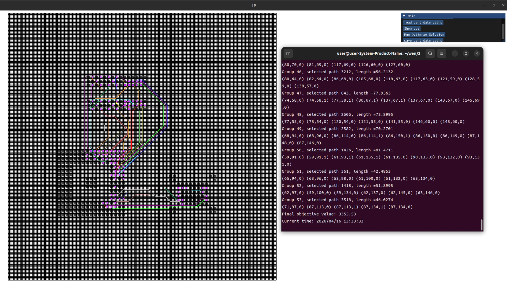
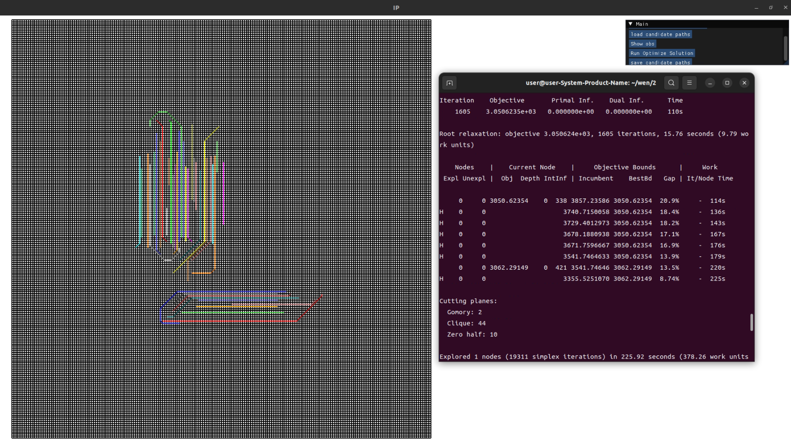

## Overview

This project demonstrates the workflow from **path generation** to **selecting an optimal solution** from multiple candidate paths.

## How to Run

Based on CMake configuration, install dependencies and set up Gurobi.
(Linux environment used by the author; not required.)


Build and Run :

```shell
# From project root
$ cmake -S . -B build -DCMAKE_TOOLCHAIN_FILE=~/vcpkg/scripts/buildsystems/vcpkg.cmake
    # adjust the vcpkg path according to your environment
$ cmake --build build -j$(nproc)
$ ./build/main
```

---


- Click `load candidate paths` to load pre-stored candidate paths, or click `born solid line candidate` to generate candidate paths.
- Click `Run Optimize Solution` to find a set of solutions from multiple candidate paths.


## Examples

- UI


- Candidate Paths Generation


- `Run Optimize Solution` result

    - Top Layer
    
    - Bottom Layer
    


## Dependencies

This project relies on the following external libraries to compile and run:

* **[Gurobi Optimizer](https://www.gurobi.com/):** Used for solving the mixed-integer programming (MIP) models.
  * **Important:** Gurobi is commercial software. This repository contains only the C++ code that calls the Gurobi API. It does **not** include the Gurobi library files or licenses. 
  * You must obtain a valid Gurobi license (free academic licenses are available) and install the software on your system independently before compiling this project.


## Acknowledgements / Third-Party Assets

This project utilizes specific component libraries (PCB footprints) extracted from the following open-source hardware project:

* **Project:** Blixten a 6LoWPAN Gateway
* **Author:** Jonas Blixt
* **Source:** https://github.com/jonpe960/blixten

**Note on Usage:** Only the component definitions (symbols and footprints) from the Blixten project were utilized. The PCB routing was designed and executed entirely independently for this project. Full credit goes to Jonas Blixt for his meticulously crafted component libraries.

